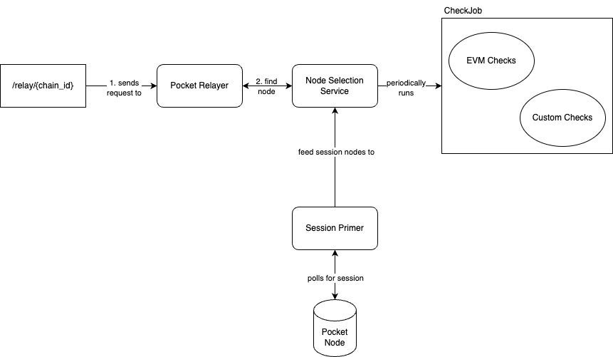

# POKT Gateway Node Selection <!-- omit in toc -->

- [Node Selection System Architecture](#node-selection-system-architecture)
- [QoS Controls](#qos-controls)
- [Node Selector](#node-selector)
  - [Checks Framework](#checks-framework)
  - [Existing QoS checks](#existing-qos-checks)
    - [Height Check (i.e. sync checks)](#height-check-ie-sync-checks)
    - [Data Integrity Check (quorum checks)](#data-integrity-check-quorum-checks)
  - [Adding custom QoS checks](#adding-custom-qos-checks)
- [Future Improvements](#future-improvements)

## Node Selection System Architecture



- `Session Registry` - responsible for "priming" sessions asynchronously, providing session metadata, and feeding the node to the `NodeSelectorService`
- `Pocket Relayer` - responsible for sending a relay to the network
- `NodeSelectorService` - responsible for running QoS checks and identifying healthy nodes by chain.
- `ChainConfigurationRegistryService` - responsible for providing custom chain configurations such as altruists and timeouts.

## QoS Controls

The gateway kit server determines if a set of nodes are healthy based off a simple weight formula with the following
heuristics:

1. Latency (round-trip-tim)
2. Success Responses (uptime & availability)
3. Correctness in regard to other node operators (quorum checks)
4. Liveliness (syn checks)

## Node Selector

After the sessions are primed, the nodes are fed to the `NodeSelectorService` which is responsible for:

1. Running various QoS checks (Height and Data Integrity Checks)
2. Exposing functions for the main process to select a healthy node `FindNode(chainId string) string`

### Checks Framework

The gateway server provides a simple interface called a `CheckJob`. This interface consists of three simple functions

```go
type CheckJob interface {
  Perform()
  Name() string
  ShouldRun() bool
}
```

Under the hood, the NodeSelectorService is responsible for asynchronously executing all the initialized `CheckJobs`.

### Existing QoS checks

#### Height Check (i.e. sync checks)

**The general flow would be:**

1. Query all node operators height,
2. compares heights with other node operators within a specific threshold
3. filters out node operators that exceed the configurable block height tolerance.

#### Data Integrity Check (quorum checks)

The general flow would be:

1. Retrieve a unique block identifier (i.e block hash or total block tx count, etc) with a configurable block offset for randomness,
2. Query other node operators for the same block identifier
3. Filter out other node operators that return a different identifier.

Some existing implementations of Checks can be found in:

1. [evm_data_integrity_check.go](../internal/node_selector_service/checks/evm_data_integrity_check/evm_data_integrity_check.go)
2. [evm_height_check.go](../internal/node_selector_service/checks/evm_height_check/evm_height_check.go)
3. [pokt_height_check.go](../internal/node_selector_service/checks/pokt_height_check/pokt_height_check.go)
4. [pokt_data_integrity_check.go](../internal/node_selector_service/checks/pokt_data_integrity_check/pokt_data_integrity_check.go)
5. [solana_height_check.go](../internal/node_selector_service/checks/solana_height_check/solana_height_check.go)
6. [solana_data_integrity_check.go](../internal/node_selector_service/checks/solana_data_integrity_check/solana_data_integrity_check.go)

### Adding custom QoS checks

Every custom check must conform to the `CheckJob` interface. The gateway server provides a base check:

```go
type Check struct {
  NodeList           []*qos_models.QosNode
  PocketRelayer      pokt_v0.PocketRelayer
  ChainConfiguration chain_configurations_registry.ChainConfigurationsService
}
```

that developers should inherit. This base check provides a list of nodes to check and a `PocketRelayer` that allows the developer to send requests to the nodes in the network, and `ChainConfiguration` service that allows for per-chain specific check configurations.

Checks are designed to be opinionated and there are numerous ways to implement whether a node is healthy or not by definition. Therefore, implementing custom QoS checks will be dependent on the chain or data source the developer is looking to support. For example, the developer may want to send a request to a custom blockchain node with a custom JSON-RPC method to see if the node is synced by using the provided `PocketRelayer` to send a request to the node through Pocket network.
If the node is not synced, the developer can set a custom punishment through the various functions exposed in [qos_node.go](../internal/node_selector_service/models/qos_node.go), such as `SetTimeoutUntil` to punish the node.

Once the developer is finished implementing the CheckJob, they can enable the QoS check by initializing the newly created check into the `enabledChecks` variable inside [node_selector_service.go](../internal/node_selector_service/node_selector_service.go) and are encouraged to open up a PR for inclusion in the official repository.

## Future Improvements

- Long term persistent results
  - Pros: More data to work with on determining if a node is healthy
  - Cons: Expensive, more complex logic (due to geographic regions) and can be punishing to new node operators
- Rolling up the results for long term storage & historical look back
