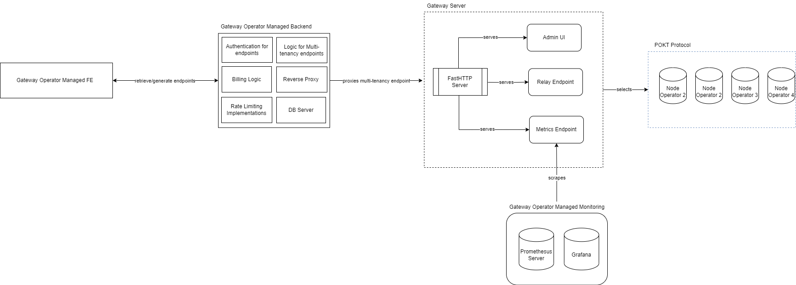

# POKT Gateway Server Architecture

## Gateway Server Managed Responsibilities
Under the hood, the gateway server handles everything in regard to protocol interaction abstract away the complexity of retrieving a session, signing a relay and sending it to a respective node and other functionality such as:
- Node Selection & Routing (QoS) - determining which nodes are healthy based off responses
- Provides underlying Prometheus metrics endpoint for relay performance metadata
- Providing an efficient HTTP endpoint to send requests to

## Gateway Operator Managed Responsibilities
- Keeping the encryption key and respectively the app stakes keys secure.
- Staking in the approriate chains
- Any features in regard to a SaaS business as mentioned in the [overview](overview.md).